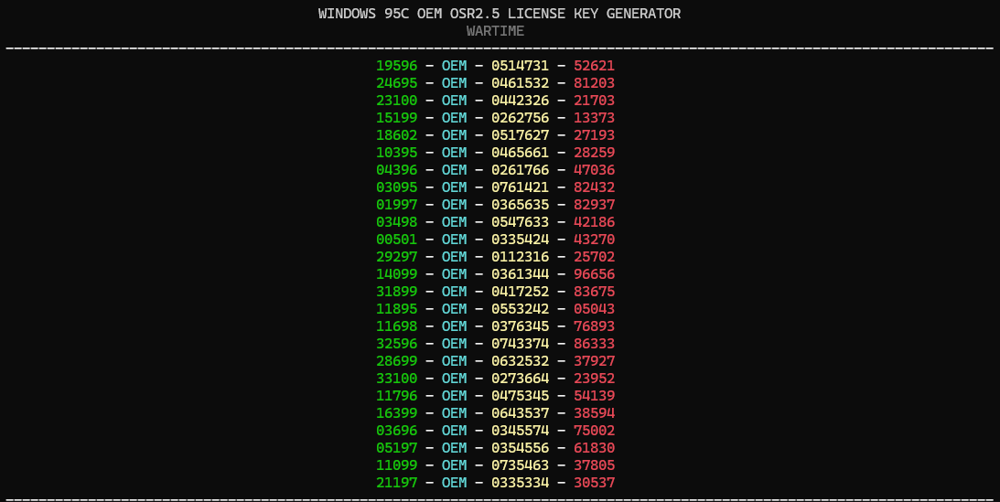

# 💾 Windows 95 OEM Key Generator

> ⚠️ *This tool was designed to generate license keys for **Windows 95C OEM OSR2.5**. License keys generated may not work with other versions.*

## 📄 Description
A tool that generates license keys for Windows 95 OEM.

## ▶️ Usage
From the terminal, navigate to the directory containing the executable and execute it.

`./w95kg.exe`

An optional argument can be passed to specify the number of keys to generate. If no additional argument is passed 25 keys will be generated.For example, in order to generate 10 keys:

`./w95kg.exe 10`

## Specification
A document which contains the specification used for this tool can be found [here](./SPECIFICATION.md).
